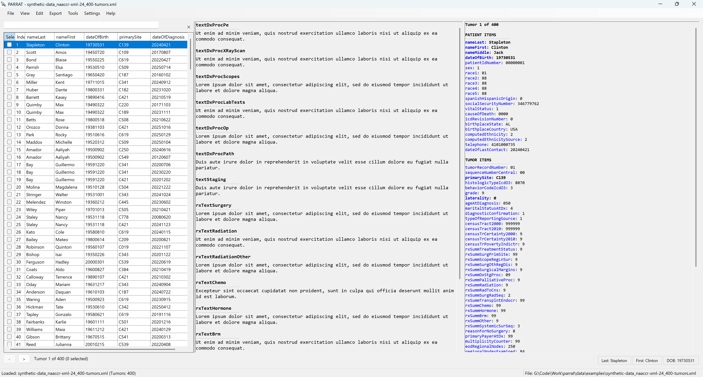

# PARRAT

**PARRAT** (PAthology Report and Registry Abstract Tools) is a self-contained Windows desktop application for viewing, converting, deduplicating, and exporting pathology reports in HL7 and NAACCR XML formats.

## Installation

1. Download the latest `Parrat-*.zip` from [Releases](../../releases/latest)
2. Extract to any folder
3. Run `PARRAT.exe`

No installer or .NET runtime required. The application is fully self-contained.

## Requirements

- Windows 10 or later (x64)
